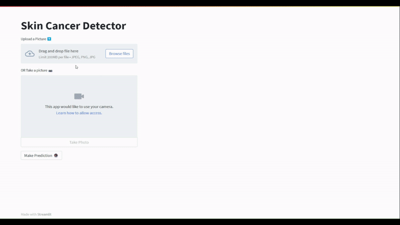

<p align="center">
    <b>
        <h1 align="center">🧑🏻‍🏭 Warehouse Apparel Detector 👨🏻‍🔧</h1>
    </b>
</p>
<!-- <p align="center">
    <em>A Vision AI based object detection web app to detect the warehouse apparel present in the image</em>
</p> -->
<p align="center">
<a href="https://github.com/Hassi34/Warehouse-Apparel-Detector-YOLOv5">
    
</a>
</p>
<p align="center">
<a href="https://github.com/Hassi34/Warehouse-Apparel-Detector-YOLOv5">
    
</a>
</p>

<p align="center">
    <a href="https://www.python.org/downloads/">
        
    </a>
    <a href="https://github.com/Hassi34/Warehouse-Apparel-Detector-YOLOv5">
        
    </a>
    <a href="https://github.com/Hassi34/Warehouse-Apparel-Detector-YOLOv5">
        
    </a>
    <a href="https://github.com/Hassi34/Warehouse-Apparel-Detector-YOLOv5">
        
    </a>
    <a href="https://github.com/Hassi34/Warehouse-Apparel-Detector-YOLOv5/blob/main/LICENSE">
        
    </a>
</p>
<p align="center">
    
</p>

## Overview
This project contains the implementation of REST API and WEB APP empowered by Vision AI to detect and make the prediction for potential risk of skin cancer while provided with the image of skin.The model is trained using TensorFlow. The REST API services are being distributed through docker image. You can pull the image from [Docker Hub](https://hub.docker.com/r/hassi34/skincancer-detector).The image comes as the production ready with unit tests and standard algorithm implemented which can be used to expose the REST API to the web.<br>
Following are the major contents to follow, you can jump to any section:

>   1. [Run Locally](#run-local)
>   2. [Model Training](https://github.com/Hassi34/Skin-Cancer-Detector-TF/blob/main/SkinCancerModelTraining.ipynb)
>   3. [REST API](#rest-api)<br>
>      - [Pull Image From Docker Hub](#docker-pull)<br>
>      - [Docker Container](#docker-container)<br>
>           - [Run a Docker Container](#run-docker-container)<br>
>           - [Perform Unit Tests](#unit-tests)<br>
>           - [API documentation](#api-docs)<br>
>      - [Make an API Request](#request-api)<br>

## Run Locally<a id='run-local'></a>

Clone the project

```bash
  git clone https://github.com/Hassi34/Skin-Cancer-Detector-TF.git
```

Go to the project directory

```bash
  cd Skin-Cancer-Detector-TF
```

Install dependencies

```bash
  pip install -r requirements.txt
```

Start the server

```bash
  streamlit run app.py
```
## REST API<a id='rest-api'></a>
To run the following sequence of commands, make sure you have the docker installed on your system.

### Pull Image from Docker Hub<a id='docker-pull'></a>
In case you have not already pulled the image from the Docker Hub, you can use the following command:
```bash
docker pull hassi34/skincancer-detector
```

### Docker Container<a id='docker-container'></a>
Now once you have the docker image from the Docker Hub, you can now run the following commands to test and deploye the container to the web

* Run a Docker Container<a id='run-docker-container'></a><br>
Check all the available images:
```bash
docker images
```
Use the following command to run a docker container on your system:
```bash
docker run --name <CONTAINER NAME> -p 80:80 -d <IMAGE NAME OR ID>
```
Check if the container is running:
```bash
docker ps
```
If the container is running, then the API services will be available on all the network interfaces<br>
Type **``localhost``** in the brower and see if the get the success message from the API service.

* Perform Unit Tests<a id='#unit-tests'></a><br>
After when the API services are up and running, run the following command on the termial to perform the unit test:
```bash
docker exec -it <CONTAINER NAME OR ID> pytest
```
* API documentation<a id='api-docs'></a><br>
The automatic API documentation will be available at http://localhost

### Make an API Request<a id='request-api'></a>
Use the following script as a reference to make a REST API request:

```python
import requests
import base64

IN_IMG_PATH = "in.jpg" # You can give any name with the right extension
OUT_IMG_PATH = "out.jpg" 
ENDPOINT = "http://127.0.0.1/predict"

def decodeImage(base64_str, OUT_IMG_PATH):
    imgdata = base64.b64decode(base64_str)
    with open(OUT_IMG_PATH, 'wb') as f:
        f.write(imgdata)
        f.close()


def encodeImageIntoBase64(IN_IMG_PATH):
    with open(IN_IMG_PATH, "rb") as f:
        return base64.b64encode(f.read())

if __name__ == '__main__':

    BASE64_STR = encodeImageIntoBase64(IN_IMG_PATH).decode("utf-8")
    response = requests.post(ENDPOINT, json={"base64_str":BASE64_STR})
    if response.status_code == 200:
        response = response.json()
        print(response)
        decodeImage(response["base64_str"], OUT_IMG_PATH)
    else :
        print(response)
```
#### **Thank you for visiting 🙏 I hope you find this project useful**<br><br>

#### **📃 License**
[MIT][license] © [Hasanain][website]

[license]: /LICENSE
[website]: https://hasanain.aicaliber.com

**Copyright &copy; 2023 Hasanain** <br>
Let's connect on **[``LinkedIn``](https://www.linkedin.com/in/hasanain-mehmood)** <br>